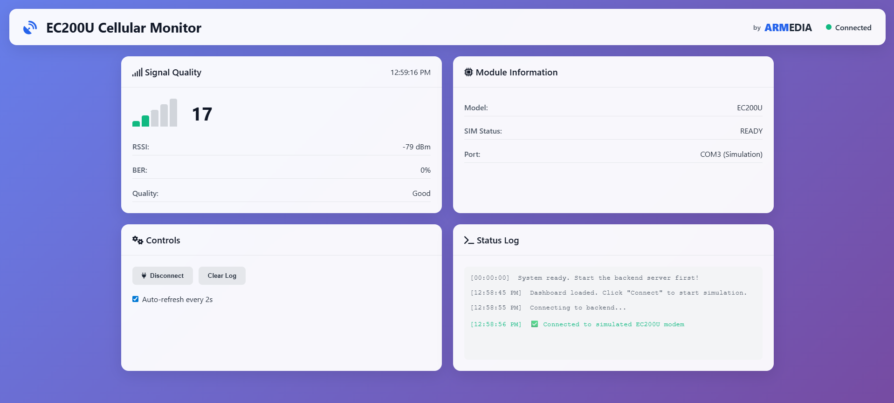

# Quectel-EC200U-Signal-Monitor

A modern, API-driven telemetry and signal monitoring tool for the Quectel EC200U cellular module and other AT-command-based devices.  
The project has been fully refactored in **v2** to use a **FastAPI backend**, enabling a browser-based dashboard and optional hardware-free simulation mode.

---

## Why v2?

v2 replaces the original CLI-based telemetry logger with a modern API architecture that supports:
- **Web dashboards** for real-time monitoring
- **Browser-based communication** through FastAPI
- **Simulation without hardware** for testing and development

This makes the project scalable and future-friendly for IoT, automation, and cloud integration.

---

## Overview

The system provides:
- A **FastAPI backend** that communicates with the EC200U through serial AT commands.
- A **web dashboard** (HTML/JS/CSS) that visualizes signal quality, device status, and module information.  
- A **simulation mode** that allows development and testing without the physical modem.

---

## Features

### Backend (FastAPI – v2)
- **Automatic AT port detection**  
  Identifies available USB/COM interfaces and detects the AT command port.

- **REST API for AT command diagnostics**  
  `/connect`, `/disconnect`, `/status`.

- **Simulation mode**  
  Provides realistic modem behavior and fluctuating signal values when no hardware is available.

- **Structured AT command execution**  
  Consistent and safe execution of `AT`, `ATI`, `AT+CPIN?`, `AT+CSQ`, and more.

- **Error-handled serial communication**  
  Clean communication, automatic buffer resets, and graceful failure management.

### Frontend (Web Dashboard)
- **Real-time Signal Quality Visualization**: RSSI, BER, and Signal strength bars.
- **Modern, Responsive UI**: Designed to work seamlessly across mobile and desktop platforms.
- **Connection Status Monitoring**: Displays real-time connection status and auto-refresh every 2 seconds.
- **Signal Bars**: Color-coded visual indicators of signal quality.
- **Module Information**: Displays module model, revision, and SIM card status.
- **Interactive Controls**: Port scanning, manual connection, and log clearing functionalities.

### New in v2
- Complete transition from CLI script to **FastAPI web service**.
- Dedicated `SerialManager` class for device handling.
- CORS-enabled backend for browser communication.
- Fully functional **hardware simulator**.

---

## Requirements

- Python 3.8+  
- EC200U module (optional with simulation mode enabled)
- Required Python libraries:

```bash
pip install fastapi uvicorn pyserial
```

Or:

```bash
pip install -r requirements.txt
```

---

## Installation

Clone the repository:

```bash
git clone https://github.com/amirradnia99/Quectel-EC200U-Signal-Monitor.git
cd Quectel-EC200U-Signal-Monitor
pip install -r requirements.txt
```

### Running the FastAPI Backend

Start the backend API:

```bash
uvicorn main:app --reload
```

Replace `main` with your FastAPI filename.

(Example: If your backend file is named `api_server.py`, then run `uvicorn api_server:app --reload`.)

Backend will be available at:

[http://127.0.0.1:8000](http://127.0.0.1:8000)

API documentation (Swagger UI):

[http://127.0.0.1:8000/docs](http://127.0.0.1:8000/docs)

### API Endpoints

- **POST /connect**: Connects to the detected AT port or simulation environment.
- **POST /disconnect**: Closes the current modem or simulated session.
- **GET /status**: Returns:
  - Module info (ATI)
  - SIM status (AT+CPIN?)
  - Signal quality (AT+CSQ)

#### Example JSON response:

```json
{
  "info": { "status": "success", "data": ["EC200U", "Revision: LTE_1.0", "OK"] },
  "sim": { "status": "success", "data": ["+CPIN: READY", "OK"] },
  "signal": { "status": "success", "data": ["+CSQ: 20,1", "OK"] }
}
```

### Simulation Mode

If enabled in the backend code:

```python
SIMULATION_MODE = True
```

The software will simulate:
- Port detection
- Module info
- SIM state
- Signal strength variations
- Response timing

Useful for front-end work or development without hardware.

### Frontend Dashboard

The included web dashboard connects to the FastAPI backend and displays:
- RSSI and BER (via AT+CSQ)
- Module info
- SIM card status
- Connection state

Hosted locally by simply opening `index.html` in a browser.

**Note**: The **frontend dashboard** is now included as a **Git submodule** in the `frontend/` directory. Clone the backend repository with the submodule by using:

```bash
git clone --recursive https://github.com/amirradnia99/Quectel-EC200U-Signal-Monitor.git
```

Alternatively, you can clone the frontend repository separately by following the instructions here: **[Quectel-Monitor-Frontend](https://github.com/amirradnia99/Quectel-Monitor-Frontend)**.

---

## File Overview

| File                          | Purpose                                                             |
|-------------------------------|---------------------------------------------------------------------|
| `main.py`                     | FastAPI backend, API routes, SerialManager integration              |
| `index.html`                  | Frontend dashboard UI                                              |
| `style.css`                   | Dashboard styling                                                   |
| `script.js`                   | Frontend logic and API communication                               |
| `requirements.txt`            | Python dependencies                                                 |

---

## Troubleshooting

### No AT port detected
- Ensure the EC200U module is powered and visible (`/dev/ttyUSB*` or `COMx`).

### CORS or browser errors
- Verify the backend is running and accessible.
- Confirm correct URL in `script.js`.

### Unexpected timeouts
- Replace USB cable.
- Increase serial timeout in `SerialManager`.

---

## License

Distributed under the MIT License.

---

## Contributors

- **Backend Development**: Amir Radnia – FastAPI backend, SerialManager, AT command handling
- **Frontend Development**: Reza Faridi – Dashboard UI, API integration
- **Systems Integration**: Amir Radnia & Reza Faridi
- **Co-contribution**: [Faridi1419 - ARMEDIA](https://github.com/Faridi1419/ARMEDIA) – Collaborated on various components and system integration.

**Screenshot** of the dashboard:


